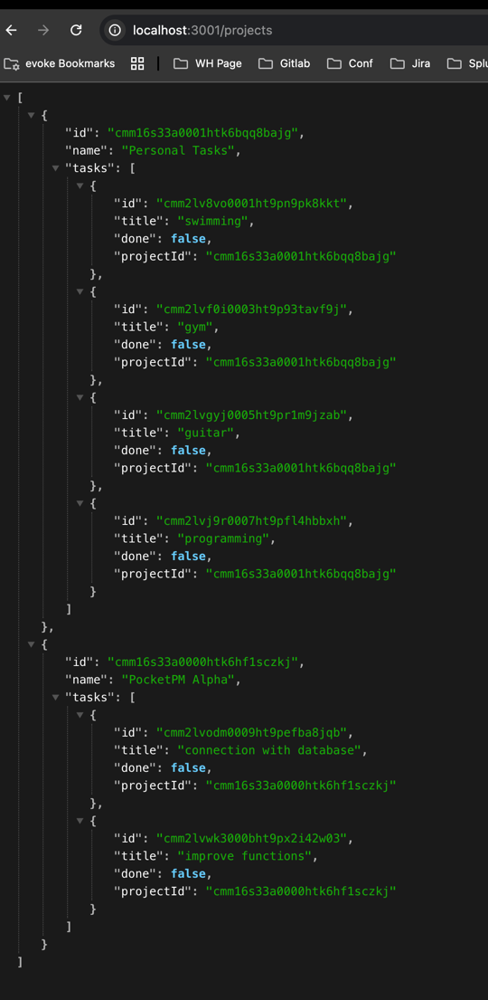

## Requirements
- Node.js (recommended: LTS)
- npm
- A database available via `DATABASE_URL` or SQLite (if you use a local `.db` file)

## Installation
1. Install dependencies:
    - `npm install`

2. Configure environment variables:
    - create a `.env` file in the project root
    - at minimum set:
        - `DATABASE_URL=...`

   > The application requires `DATABASE_URL`; without it the startup will fail.

## Prisma - Database setup
1. Generate Prisma Client:
    - `npx prisma generate`

2. Apply migrations:
    - development (recommended):
        - `npx prisma migrate dev`
    - alternatively (e.g. CI/production):
        - `npx prisma migrate deploy`

---

## Frontend app (optional, for full experience)

To run the full application (UI + API), start the frontend repository: `pocketpm-web`.

- This API can run standalone, but the full user experience requires the frontend to be running (locally or deployed).
- Frontend setup and run steps are described in the `pocketpm-web` repository README.

In short:
- clone and run `pocketpm-web` in parallel with this API
- follow the frontend README for configuration and startup steps (e.g. API base URL)

### URL:
- https://github.com/dariuszS93/pocketpm-web

---

## Running the project
### Development (watch mode)
- `npm run dev`

### Build
- `npm run build`

### Start (after build)
- `npm run start`

## Database seeding (optional)
If the project includes a seed script:
- `npm run seed`

## Prisma Studio - Database management UI
To open the UI for browsing and editing database data:
- `npx prisma studio`

Prisma Studio uses `DATABASE_URL` from `.env`.

## License

Copyright (c) 2026 Dariusz Steblik. All rights reserved.

This project is proprietary. No license is granted to use, copy, modify, or distribute
this code without prior written permission. See `LICENSE` for details.

#### Screenshots
- 
